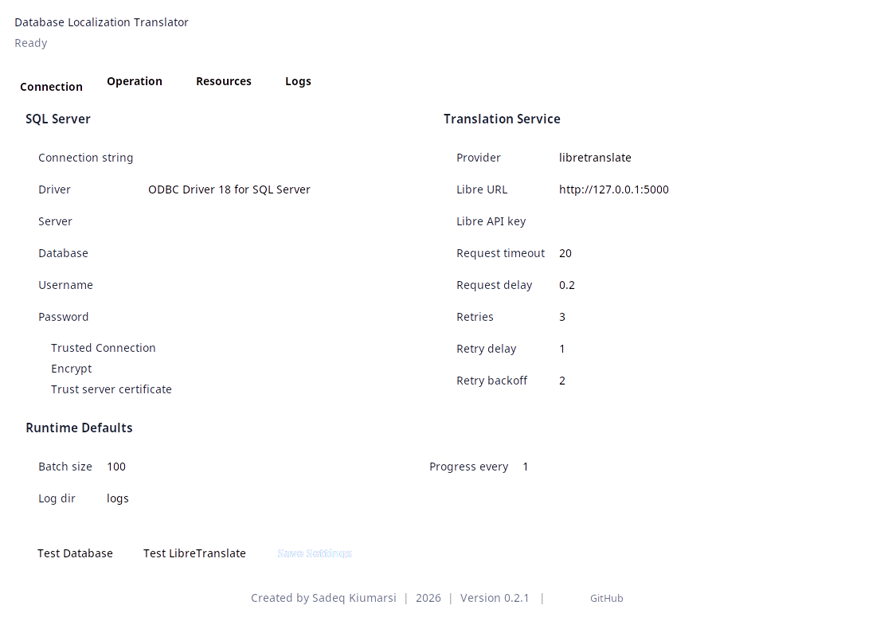
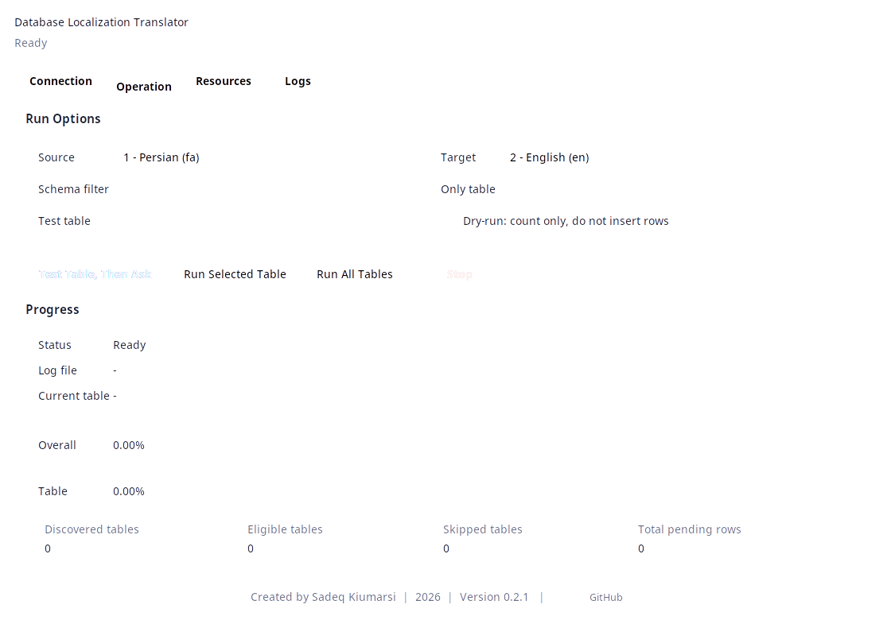
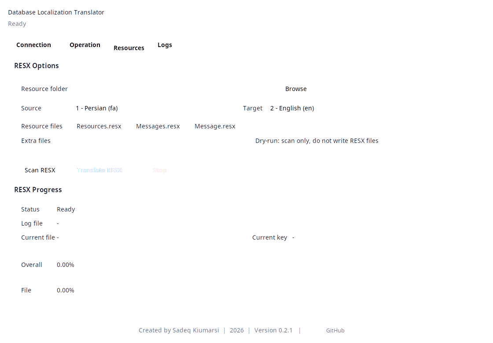
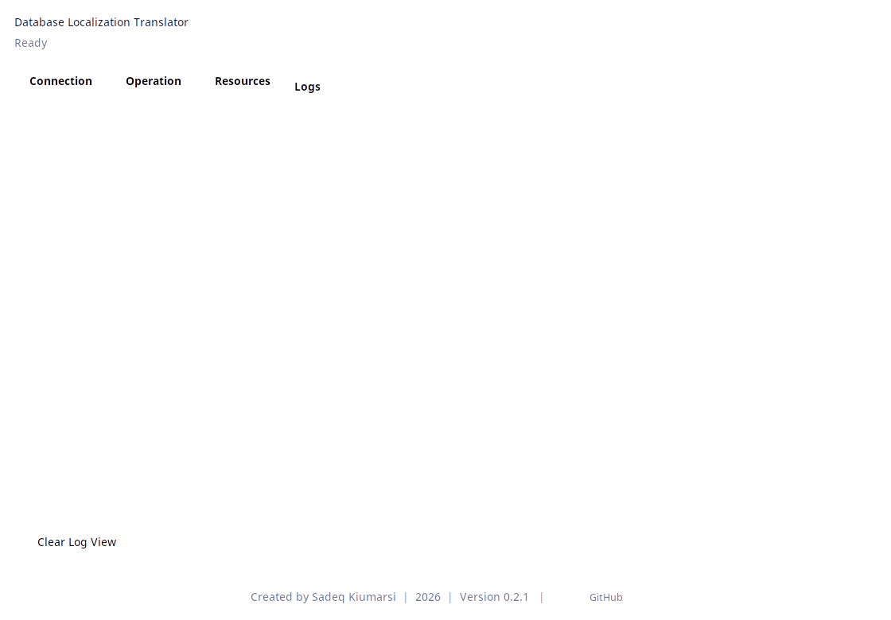

<p align="center">
  
</p>

<h1 align="center">SQL Server Localization Translator</h1>

<p align="center">
  A desktop and command-line tool for safely translating SQL Server localization records and .NET RESX resources.
</p>

<p align="center">
  
  
  
  
  
</p>

<p align="center">
  <strong>Version 0.2.1</strong> · <strong>2026</strong> · Created by <strong><a href="https://github.com/mehmed18q">Sadeq Kiumarsi</a></strong>
</p>

---

## Overview

SQL Server Localization Translator discovers localization tables, reads records in a source language, translates approved text fields, and creates or completes records in a destination language. It also translates standard `.resx` files used by .NET applications.

The Windows executable is self-contained: the destination computer does **not** need Python or any Python package installed. Microsoft ODBC Driver 18 for SQL Server remains a system prerequisite.

## Screenshots

The screenshots below were captured from the Linux build. The Windows executable provides the same four application tabs and workflow.

| Connection | Operation |
|:---:|:---:|
|  |  |

| Resources | Logs |
|:---:|:---:|
|  |  |

## Highlights

- Desktop GUI with `Connection`, `Operation`, `Resources`, and `Logs` tabs.
- Automatic discovery of tables ending in `Localize` or `Localizes`.
- Special handling for `dbo.Resource` and `dbo.SystemMessages`.
- Inserts missing destination-language records.
- Updates only empty translatable fields in an existing destination record.
- Never overwrites a populated translation.
- Dry-run mode is enabled by default for safer review.
- RESX scanning, creation, and translation with existing values preserved.
- Live progress, stop controls, retries, translation caching, and detailed logs.
- LibreTranslate and Google Free translation providers.
- Persistent settings and logs beside the packaged executable.
- Startup detection for Microsoft ODBC Driver 18.
- Visible application version in the window title and permanent footer.
- Clickable GitHub shortcut in the footer that opens the project repository.

## Windows executable

The ready-to-run application is:

```text
output\Translator.exe
```

To use it on another Windows x64 computer:

1. Copy `Translator.exe` into a folder where the user has write permission.
2. Install **Microsoft ODBC Driver 18 for SQL Server** if it is not already installed.
3. Open `Translator.exe`.
4. Enter the SQL Server and translation-provider settings in the `Connection` tab.
5. Use `Test Database` and, when applicable, `Test LibreTranslate`.
6. Save the settings and start with a dry run from the `Operation` or `Resources` tab.

Python, `pip`, Tkinter, `requests`, and `pyodbc` are bundled into the executable. They do not need to be installed separately.

> [!IMPORTANT]
> Microsoft ODBC Driver 18 is not bundled because it is a Windows system driver. At startup, the application checks for the exact driver name `ODBC Driver 18 for SQL Server`. If it is missing, a warning explains what must be installed before connecting to SQL Server.

The driver can normally be installed from PowerShell with:

```powershell
winget install Microsoft.msodbcsql.18
```

## Files created beside the executable

The packaged application deliberately keeps user data outside its temporary embedded-Python directory:

```text
Translator.exe
.env
logs\
  translator_YYYYMMDD_HHMMSS.log
```

- `.env` stores settings saved from the GUI.
- `logs` contains one timestamped log file for each operation.
- Both locations remain stable after the application closes or Windows restarts.

Keep `Translator.exe` in a writable folder. The `.env` file can contain database credentials, so protect the folder and do not publish that file.

## Application tabs

| Tab | Purpose |
|---|---|
| `Connection` | Configure and test SQL Server, select the translation provider, set retry/runtime options, and save settings. |
| `Operation` | Select source and target languages, filter by schema/table, run a test table, or process all eligible tables. |
| `Resources` | Scan or translate `.resx` files, choose standard or extra resource names, and review file-level progress. |
| `Logs` | Follow the current operation in real time and clear the on-screen log view. Clearing the view does not delete the log file. |

The footer is outside the tab area and always shows:

```text
Created by Sadeq Kiumarsi | 2026 | Version 0.2.1 | GitHub
```

## Safe translation behavior

Database processing follows these rules:

1. Discover eligible localization and special-case tables from SQL Server metadata.
2. Match source and destination records by entity key plus language ID.
3. Insert a translated record when the destination record does not exist.
4. When the destination exists, translate only its empty approved text columns.
5. Preserve every destination field that already has a value.

Only textual SQL columns whose names are approved in `translator_app/translatable_columns.py` are translated. Identity, computed, and rowversion columns are excluded from inserts. Foreign-key metadata is preferred for entity matching; the table name is used as a fallback convention when a suitable foreign key is unavailable.

HTML content is detected automatically. `HTMLContent` fields and values that look like HTML are sent to compatible providers with `format=html`; ordinary values use `format=text`.

### Special tables

| Table | Matching key | Translated value |
|---|---|---|
| `dbo.Resource` | `Key` | `Value` |
| `dbo.SystemMessages` | `SystemMessageStateId` + `MessageKey` | `Value` |

## Supported languages

| ID | Language | Code |
|---:|---|:---:|
| 1 | Persian | `fa` |
| 2 | English | `en` |
| 3 | Arabic | `ar` |
| 4 | French | `fr` |
| 5 | Chinese | `zh` |
| 6 | Russian | `ru` |

## Translation providers

| Provider | Notes |
|---|---|
| `libretranslate` | GUI default. Configure a self-hosted or remote LibreTranslate URL and optional API key. |
| `google-free` | CLI default. Uses a public, unofficial endpoint and may be rate-limited or changed by the provider. |

For controlled production use, a self-hosted LibreTranslate instance is recommended.

## RESX translation

The `Resources` tab supports standard .NET resource naming:

- English uses a neutral resource such as `Resources.resx` or `Messages.resx`.
- Other languages use a culture suffix, such as `Resources.fa.resx`, `Resources.ar.resx`, or `Messages.ru.resx`.
- `Resources.resx`, `Messages.resx`, and `Message.resx` can be selected directly; extra base filenames are also supported.
- Existing destination keys with values are skipped.
- Empty source values are skipped.
- A missing destination file is created from the source structure so the RESX headers and schema are preserved.
- Format placeholders such as `{0}` are preserved during translation.
- Dry-run scans and reports pending entries without writing files.

## Logs

Every database or RESX operation creates a UTF-8 log file named:

```text
logs/translator_YYYYMMDD_HHMMSS.log
```

Logs include discovered and eligible tables/files, pending counts, row or key progress, inserted and updated records, skipped existing values, retries, failures, and full exception details. In the GUI, the same operation messages appear live in the `Logs` tab.

For the packaged executable, logs are written beside `Translator.exe`. For a source checkout, relative log paths are resolved from the current working directory.

## Run from source

### Requirements

- Python 3.12
- Tkinter
- Microsoft ODBC Driver 18 for SQL Server
- Access to SQL Server
- Access to the configured translation provider

Create an environment and install dependencies:

```bash
python -m venv .venv
source .venv/bin/activate
python -m pip install -r requirements.txt
```

On Windows PowerShell:

```powershell
py -3.12 -m venv .venv
.\.venv\Scripts\Activate.ps1
python -m pip install -r requirements.txt
```

On Linux, install Tkinter, unixODBC, and Microsoft ODBC Driver 18 through your distribution before starting the application.

### Start the GUI

Running without arguments opens the GUI:

```bash
python main.py
```

The explicit form is also supported:

```bash
python main.py --gui
```

### Configure with `.env`

Copy `.env.example` to `.env`, then update the values you need. A complete connection string can also be supplied through `SQLSERVER_CONNECTION_STRING`.

```dotenv
SQLSERVER_DRIVER=ODBC Driver 18 for SQL Server
SQLSERVER_SERVER=localhost
SQLSERVER_DATABASE=YourDatabase
SQLSERVER_USERNAME=sa
SQLSERVER_PASSWORD=your_password
SQLSERVER_TRUSTED_CONNECTION=false
SQLSERVER_NO_ENCRYPT=false
SQLSERVER_TRUST_SERVER_CERTIFICATE=true

TRANSLATOR_PROVIDER=libretranslate
LIBRETRANSLATE_URL=http://127.0.0.1:5000
LIBRETRANSLATE_API_KEY=
LOG_DIR=logs
```

## Command-line examples

The CLI uses dry-run unless `--execute` is explicitly supplied.

Preview Persian-to-English database work:

```bash
python main.py --cli --source-language-id 1 --target-language-id 2
```

Execute all eligible tables:

```bash
python main.py --cli --source-language-id 1 --target-language-id 2 --execute
```

Process one table only:

```bash
python main.py --cli --source-language-id 1 --target-language-id 2 \
  --schema dbo --table SiteMenuLocalize --execute
```

Run one test table before deciding whether to continue:

```bash
python main.py --cli --source-language-id 1 --target-language-id 2 \
  --test-table dbo.SiteMenuLocalize --execute
```

Use LibreTranslate:

```bash
python main.py --cli --provider libretranslate \
  --libretranslate-url http://localhost:5000 \
  --source-language-id 1 --target-language-id 2 --execute
```

Run `python main.py --cli --help` for the complete option list.

## Build the Windows executable

From Windows PowerShell in the project root:

```powershell
.\build_windows.ps1
```

The script creates a Python 3.12 build environment when needed, installs build dependencies, runs the test suite, and packages the GUI with PyInstaller. The result is written to:

```text
output\Translator.exe
```

The GitHub Actions workflow named **Build Windows executable** can also be started manually. It publishes the `Translator-Windows-x64` artifact after a successful test and build run.

## Technology

| Component | Technology |
|---|---|
| Primary language | Python 3.12 |
| Desktop interface | Tkinter / ttk |
| SQL Server access | pyodbc + Microsoft ODBC Driver 18 |
| HTTP translation clients | Requests and Python standard library |
| Windows packaging | PyInstaller |
| Configuration | `.env`-style key/value file |
| Testing | Python `unittest` |

## Tests

Run the complete test suite with:

```bash
python -m unittest discover -s tests -p "test*.py"
```

The current release passes **53 tests**.

## Versioning

The single source of truth for the application version is `translator_app/__init__.py`:

```python
__version__ = "0.2.1"
```

Update this value for future releases. The GUI window title and permanent footer read it automatically, making the version visible to every user.

## Author

Designed and developed by **[Sadeq Kiumarsi](https://github.com/mehmed18q)** in **2026**.

Project repository: **[github.com/mehmed18q/Translator](https://github.com/mehmed18q/Translator)**
